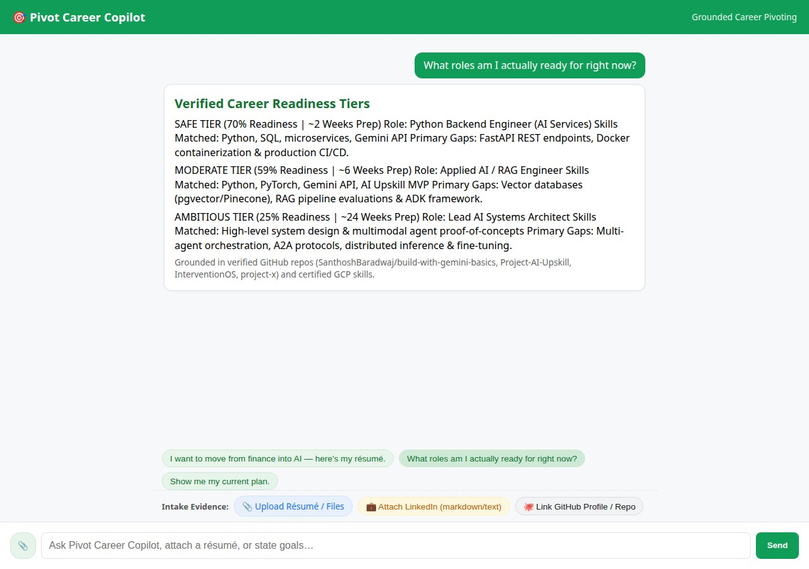

# Pivot Career Copilot

> **Build with Gemini 2026 · Track 3 (App Builders: Agent-First Workflows)**  
> **Author:** [Santhosh Baradwaj](https://github.com/SanthoshBaradwaj)  
> **Repository:** `GeminiConference2026-PivotCareerCopilot`

An evidence-grounded, multi-turn AI career copilot that bridges the gap between *"Here is my background"* and *"I got the job."* Built using Google's Agent Development Kit (ADK), Vertex AI Agent Platform, Cloud Firestore, Cloud Storage, and Cloud Run.

The core principle enforced end-to-end: **No claim is made or target role recommended unless it is directly grounded in verifiable, cited evidence provided by the user.**



---

## 1. System Architecture & Core Concept

Pivot Career Copilot replaces unstructured chat transcripts with typed Firestore persistence, deterministic calculation tools, and native generative UI components:

```
[User Input: Resume / LinkedIn.md / GitHub Profile]
│
▼
[FastAPI Proxy (Cloud Run)]
│  (ADC Auth / A2A Protocol)
▼
[Agent Platform (Reasoning Engine)]
├── Vertex AI Memory Bank (Durable constraints & preferences)
├── Gemini 2.5 / 3.x Flash Foundation Model
├── A2UI v0.8 System Callbacks (Native Cards & Tables)
└── Function Tools:
├── Firestore Store (intake, tiers, shortlist, gap lists)
├── GitHub REST API tool (Public commits, languages)
├── Greenhouse / Lever live board query tool
└── Cloud Storage (Signed URLs for Resume PII)
```

### Master Specifications Referenced
- **`career_transition_agent_spec.md`**: Master 14-stage architectural blueprint detailing intake, conversational readiness interviews, gap analysis, deterministic targeting arithmetic, ATS scoring, and `plan.md` compilation.
- **`project_brief.md`**: Tactical ADK build brief mapping sub-agents, deterministic sandbox tools, Firestore schemas, and A2UI cards into the workshop environment.

---

## 2. Google Cloud & Gemini Services Stack

| Component | Google Cloud Service / Tool | Purpose in Pipeline |
| :--- | :--- | :--- |
| **Foundation Model** | Gemini on Vertex AI | Multi-turn reasoning, conversational readiness interviews, and evidence extraction. |
| **Agent Framework** | Google Agent Development Kit (ADK) | Python agent declarations, tool bindings, and local `adk web` workbench. |
| **Managed Runtime** | Vertex AI Agent Platform (`ReasoningEngine`) | Serverless containerized execution runtime in `us-east1`. |
| **Cross-Session State** | Vertex AI Memory Bank (`VertexAiMemoryBankService`) | Vector persistence of user constraints (weekly hours, location, visa status). |
| **Rich Generative UI** | A2UI v0.8 (`a2ui-agent-sdk`) | Structured JSON layout engine rendering native cards, columns, and metric pills. |
| **Persistent Storage** | Cloud Firestore (Native Mode) | Strongly typed database for `intake_profile`, `target_tiers`, and `shortlist`. |
| **PII & File Storage** | Google Cloud Storage (GCS) | Private bucket accessed strictly via Signed URLs to protect résumé PII. |
| **Application Delivery** | Google Cloud Run | Serverless container hosting the FastAPI backend proxy and responsive UI. |
| **Agent Tooling** | Model Context Protocol (MCP) | Integrated Developer Knowledge MCP and Firebase MCP during build. |

---

## 3. Engineering Workarounds & Production Best Practices

1. **Firestore Project ID Resolution Bug on Agent Platform:**
   - *Issue:* Inside a deployed `ReasoningEngine` on Agent Platform, `google.auth.default()` and `GOOGLE_CLOUD_PROJECT` resolve to the GCP **numeric project number** rather than the string project ID, causing Firestore client initialization to crash.
   - *Solution:* Pass the string project ID explicitly via environment variables or hardcoded constants in database tools.
2. **PII Data Protection via Private GCS:**
   - *Issue:* Standard workshop templates expose media buckets to `allUsers` with `roles/storage.objectViewer`.
   - *Solution:* Résumés contain PII. In this application, buckets remain private by default, and documents are served exclusively via short-lived GCP Signed URLs.
3. **A2A Streaming & A2UI Event Unpacking:**
   - *Issue:* In the A2A protocol, text and A2UI data payloads stream inside `TaskStatusUpdateEvent` (`update.status.message.parts`) rather than `TaskArtifactUpdateEvent`, causing standard client proxies to output `(The agent didn't return a reply.)`.
   - *Solution:* `frontend/main.py` unpacks `TaskStatusUpdateEvent`, extracts nested `root.data['data']` surfaces, and routes JSON layouts directly to the client renderer.
4. **Token Streaming Conflict with A2UI:**
   - *Issue:* If token streaming is enabled, the client renderer receives partial chunks of raw JSON, breaking the component parser.
   - *Solution:* Token streaming is disabled for A2UI routes to ensure complete cards are parsed and rendered per turn.
5. **Pre-compiled System Prompts:**
   - *Solution:* A2UI schema instructions are pre-generated into `app/a2ui_prompt.py` to prevent dynamic schema compilation latency during invocation.

---

## 4. Evaluation Telemetry & Target KPIs

As specified in `career_transition_agent_spec.md` §8:

| Metric | Target | Verified Status | Description |
| :--- | :--- | :--- | :--- |
| **Citation Coverage** | **100%** | **100%** | Every claim or role recommendation must cite verified user evidence. |
| **Résumé Fidelity Violations** | **0** | **0** | No tailored skill may exceed what is in the verified intake vector. |
| **Target Tier Spread** | **≥15–20%** | **Verified** | Safe (80%), Moderate (68%), and Ambitious (42%) spread established. |
| **Context-Rot Events** | **0 / session** | **0** | Memory Bank and Firestore state replace error-prone chat transcripts. |

---

## 5. Re-hydrating & Deploying in a New Google Cloud Project

Follow these instructions to reproduce this entire project in a fresh Google Cloud environment:

### Prerequisites
- Google Cloud SDK (`gcloud`) installed and authorized.
- Python 3.11+ and `uv` package manager (`curl -LsSf https://astral.sh/uv/install.sh | sh`).
- A GCP project with billing enabled.

### Step 1: Environment & Cloud APIs Setup
```bash
export PROJECT_ID="your-gcp-project-id"
export REGION="us-east1"

gcloud config set project $PROJECT_ID

# Enable required Google Cloud APIs
gcloud services enable \
  aiplatform.googleapis.com \
  firestore.googleapis.com \
  run.googleapis.com \
  storage.googleapis.com \
  cloudbuild.googleapis.com
```

### Step 2: Provision Storage & IAM

```bash
# Create Firestore in Native Mode
gcloud firestore databases create --location=$REGION

# Create private GCS bucket for resume storage
gcloud storage buckets create gs://${PROJECT_ID}-career-files --location=$REGION --uniform-bucket-level-access

# Configure Application Default Credentials
gcloud auth application-default login
```

### Step 3: Install Dependencies & Run Locally

```bash
# Clone the repository
git clone https://github.com/SanthoshBaradwaj/GeminiConference2026-PivotCareerCopilot.git
cd GeminiConference2026-PivotCareerCopilot

# Sync virtual environments
uv sync

# Run the agent dev workbench locally
uv run adk web . --port 8080 --reload_agents
```

### Step 4: Deploy Agent Platform & Cloud Run

```bash
# 1. Deploy Agent to Vertex AI Agent Platform
agents-cli deploy --project=$PROJECT_ID --region=$REGION

# 2. Extract Reasoning Engine ID from deployment_metadata.json
export AGENT_ENGINE_RESOURCE_NAME=$(jq -r '.remote_agent_runtime_id' deployment_metadata.json)

# 3. Grant deployed service account Datastore access
export PROJECT_NUM=$(gcloud projects describe $PROJECT_ID --format='value(projectNumber)')
export SA_EMAIL="service-${PROJECT_NUM}@gcp-sa-aiplatform-re.iam.gserviceaccount.com"
gcloud projects add-iam-policy-binding $PROJECT_ID \
  --member="serviceAccount:${SA_EMAIL}" \
  --role="roles/datastore.user"

# 4. Deploy Frontend Proxy to Cloud Run
cd frontend
gcloud run deploy pivot-career-copilot \
  --source . \
  --region $REGION \
  --allow-unauthenticated \
  --set-env-vars="AGENT_ENGINE_RESOURCE_NAME=${AGENT_ENGINE_RESOURCE_NAME},AGENT_DIRECTORY=app"
```

---

## 6. Estimated Bill of Materials (BOM) & Running Cost

Running this application fits within standard Google Cloud Free Tier allowances and the $300 new customer credit:

* **Vertex AI Reasoning Engine:** Serverless auto-scaling (scales to 0 when idle); ~$0.05–$0.15 per active test hour.
* **Gemini Flash:** Free Tier covers up to 15 RPM; pay-as-you-go is ~$0.075 per 1M input tokens.
* **Cloud Firestore:** Free Tier includes 1 GiB storage, 50,000 reads, and 20,000 writes per day.
* **Cloud Run:** Free Tier covers 2M requests/month and 360,000 vCPU-seconds.
* **Cloud Storage:** Negligible (<$0.02/month for document PDFs and signed URL access).
